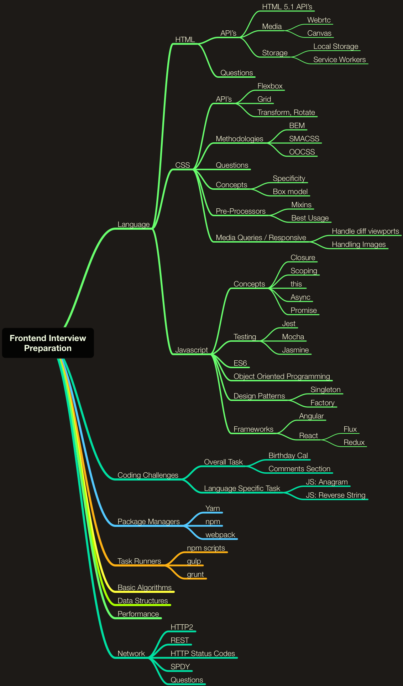

# Why?

We need one place to have a list of interview questions, concepts, coding challenges, best practices, for frontend developer interview preparation.

# How to use it?

* Fork this repo
* Go through each sections, if you are aware of the concept [or] done learning > mark it as checked using the checkbox given [ ]
* Once you complete most(80%) the sections you are well prepared / brushed up for your next challenge
* Finally, If you like the repo "star" it and contribute to maintain it to latest.

### Objective - Mindmap

### Language

* [ ] [Javascript](Javascript)
* [ ] [HTML](HTML)
* [ ] [CSS](CSS)

### Coding

* [ ] [Coding Challenges](Coding%20Problems)
* [ ] [Data Structures](Data%20Structures)

### Frameworks

* [ ] [Angular](Frameworks/AngularJS)
* [ ] [ReactJS](Frameworks/ReactJS)

### Libraries

* [ ] jQuery
* [ ] Backbone JS

### Dev, Build Tools

* [ ] Webpack
* [ ] Gulp
* [ ] Yarn
* [ ] Yeomen
* [ ] Chrome Dev Tools
* [ ] Oh My Zsh
* [ ] CSS Preprocessors (SASS, POSTCSS)

### BaaS

* [ ] AWS (Amazon)
* [ ] Azure (Microsoft)
* [ ] Graphcool (Facebook)
* [ ] Firebase (Google)

### Others

* [ ] Responsive Web Design (RWD)
* [ ] Single Page Applications (SPA)
* [ ] How Browser Works, Painting
* [ ] HTTPS, HTTP/2, SSL
* [ ] Progressive Web Application (PWA)
* [ ] Cross Platform/Hybrid App Development - Phone Gap, React Native
* [ ] Data Structures: LinkedList, Queue, Stack, Graph, Sorting Algorithm, Search Algorithm
* [ ] Test cases: Unit Testing, End to End Testing, Phantom JS

### Deployment

* [ ] Surge
* [ ] Now.sh

### Continous Intergration

* [ ] Travis
* [ ] Jenkins

PS. We are working on adding answers and more content, feel free to contribute to this repository by creating Pull Request. Thanks!
